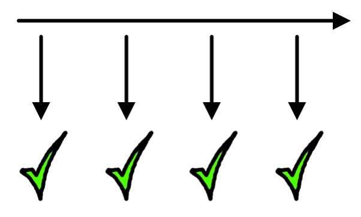
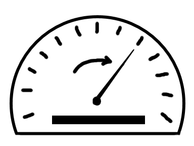

# DIE EFFEKTE VON ZERO BUGS
Von nun an ging es darum, diese Zahl zu halten. Wurden während eines Sprints neue Bugs entdeckt, mussten  sie bei nächster Gelegenheit behoben werden. Verschiedene Teams packten dies unterschiedlich an. Ein  Team hatte die Regel, dass man zwischen zwei Storys zuerst einen Bug beheben musste. Ein anderes Team  definierte pro Sprint eine Person, die sich vor allem auf Bugs konzentrierte. Ein weiteres Team koordinierte  das Bugfixing einfach am Daily Scrum. 
Unabhängig davon, wie die Zero Bug Policy umgesetzt wurde, geschahen in allen Teams kurz nach der Einführung erstaunliche Dinge. Das Gefühl der Hoffnungslosigkeit verschwand von einem Tag zum andern. Es war, als wäre allen eine schwere Last vom Herzen gefallen.

Vor der Zero Bug Policy war jeder neu entdeckte Bug nur einer von vielen.  Bugfixing war ein notwendiges Übel, das einen von der spannenderen Arbeit  abhielt. Mit der Zero Bug Policy verletzte ein neuer Bug den Stolz des Teams. Es  entstand ein regelrechter Blutrausch. Der Scrum Master musste Teammitglieder  sogar davon abhalten, alles stehen und liegen zu lassen, wenn jemand einen  neuen Bug entdeckte. 

Das Bug Management verschwand nicht, wurde aber viel einfacher. Ein Beispiel  dafür sind Bug-Duplikate. Bei mehreren hundert Bugs ist es ziemlich aufwändig  festzustellen, ob ein Bug bereits einmal erfasst wurde. Mit der Zero Bug Policy  ist es simpel. Im Idealfall hat man null Bugs. Da erübrigt sich die Suche nach  Duplikaten. Auch mit beispielsweise fünf bekannten Bugs ist die Aufgabe  immer noch trivial.

Sogar auf das Ergebnis eines Sprints hatte die Zero Bug Policy einen positiven  Effekt. Eines der Ziele jeden Sprints liegt darin, das Produkt möglichst nahe an  einem auslieferbaren Zustand zu haben (potentially shippable). Mit Hunderten  bekannter Bugs war an eine Auslieferung natürlich nicht zu denken. Dank der  Zero Bug Policy kamen wir dem Ziel nun einen grossen Schritt näher.

Darüber hinaus veränderte sich auch die Zusammenarbeit mit der nachgeschalteten Testgruppe. Früher  fühlte sich eine Auslieferung eines Sprints so an: «Hier habt ihr das neue Produkt. Findet die zwanzig neuen  Bugs, die wir zusätzlich zu den hundert bekannten seit dem letzten Sprint eingebaut haben.» Mit der Zero  Bug Policy änderte sich unsere Einstellung: «Hier habt ihr das neue Produkt. Es hat keine bekannten Bugs.  Beweist, dass wir falsch liegen.»
Und schliesslich gab es einen Effekt der Zero Bug Policy, der den beträchtlichen initialen Aufwand und alle Risiken rechtfertigte, die mit solch einer radikalen Methode verbunden sind. Unsere Velocity stieg mit Einführung der Zero Bug Policy um mindestens 30 Prozent an. Ich kann nicht mit Sicherheit sagen, was den Unterschied ausmachte. War es die gesteigerte Motivation aller Beteiligten? War es der Umstand, dass wir weniger Zeit mit Workarounds verbrachten? War es das reduzierte Bug Management? War es die generell höhere Qualität des Produkts? War es alles zusammen? Oder war es etwas ganz anderes? Eigentlich spielt es keine Rolle. Entscheidend war nur, dass wir durch die Zero Bug Policy die Arbeit, die nicht zum Wert des Produkts beitrug (Waste), beträchtlich reduzierten.

