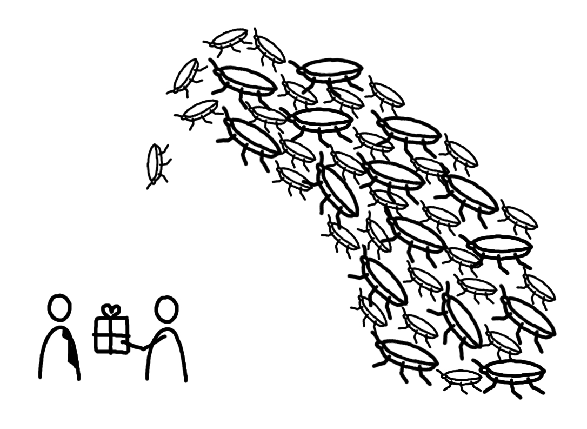
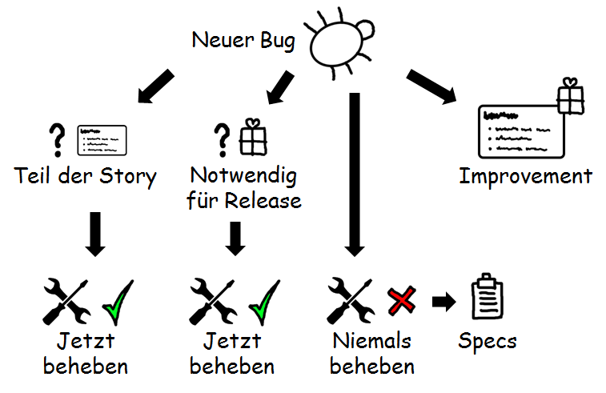

# IST ES TOT?
War das unser Happy End? Leider noch nicht ganz.  Wie in so vielen Geschichten von Hollywood war das  Monster noch nicht wirklich besiegt und griff gerade  dann noch ein letztes Mal an, als wir uns alle schon  in Sicherheit wiegten.
Version 1.0 war fertiggestellt. Dies war die erste  Version, die an einen echten Kunden ausgeliefert  wurde. Als die Teams damit begannen, an der  nächsten Produktversion zu arbeiten, geschah etwas  Unerwartetes. Die Bug-Zahl stieg mit einem Mal bei  allen Teams sprunghaft auf eine hohe zweistellige  Zahl an. Was war passiert?

Wir hatten einen wichtigen Punkt der Zero Bug Policy nicht umgesetzt. Statt zu entscheiden, ob ein Bug  behoben werden soll oder nicht, hatte das Bug-Management-Team einfach alle Bugs, die nicht in Version 1.0  behoben werden mussten, auf eine zukünftige Version verschoben.
War das wirklich falsch? Muss man  für die Zero Bug Policy wirklich  immer die harte Entscheidung  treffen, ob man einen Bug sofort  oder nie behebt? Auf der Suche  nach einer Antwort fanden wir  eine umfangreichere Definition der  Zero Bug Policy.

Als Erstes fragt man sich: Gehört der gefundene Bug zu einer Story des aktuellen Sprints? Wenn ja, dann ist  die Story nicht abgeschlossen und der Bug muss sofort behoben werden. Dies scheint offensichtlich. Aber  wir hatten tatsächlich die Situation, dass Teams Storys mit offenen Akzeptanzkriterien abschlossen, indem  sie einfach für die offenen Punkte Bugs erfassten.
Die zweite Frage kannten wir bereits: Muss der Bug behoben werden, bevor das Produkt ausgeliefert wird?  Wenn ja, dann wird der Bug sofort behoben.
Ist die Reparatur eines Bugs nicht zwingend, bietet aber einen grossen Mehrwert, wird aus dem Bug eine  Optimierung (Improvement). Diese übernimmt man als Story in die Planung der nächsten Produktversion.  Was initial als Bug galt, wird aus dem Bug-Tracking entfernt und ist für die aktuelle Version ein erwartetes  Verhalten.
Und schliesslich kann man sich auch entscheiden, einen Bug wirklich nie zu beheben. Dies ist typischerweise  bei Bugs der Fall, die sehr selten auftreten, kein Risiko verursachen, deren Behebung sehr viel kostet und sehr  wenig Mehrwert bringt.
Unabhängig davon, ob man einen Bug nie beheben will oder als Optimierung für die nächste Produktversion  plant, wird der Bug zu einem erwarteten Verhalten. Eine allfällige Spezifikation sollte dies reflektieren.  Werden die Spezifikationen aus automatischen Akzeptanztests generiert, ist dies nicht besonders schwierig.  Man fügt einfach für das erwartete Verhalten einen weiteren Test hinzu.